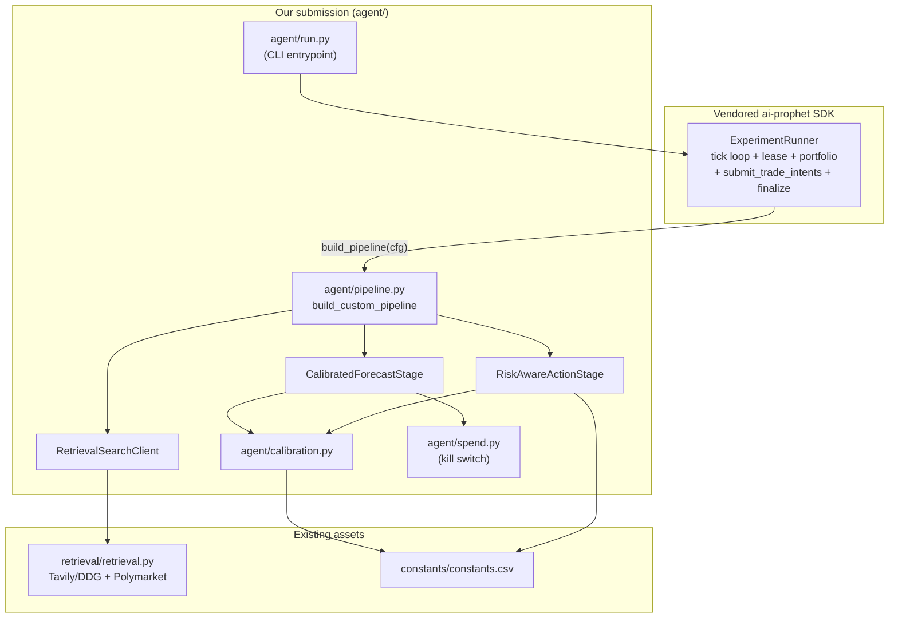

# Nailong UIC — Prophet Hacks 2026 Trading Track

Calibrated, market-anchored, Kelly-sized prediction-market trading agent
built on the vendored `ai-prophet` SDK. Runs unattended for the 14-day
evaluation window (May 17 → May 31, 2026) and emits trade intents on every
15-minute tick.

---

## What it does

Every 15 minutes, for each candidate prediction market on Prophet Arena:

1. **Review** (SDK LLM) picks which markets to spend the tick budget on.
2. **Search** (our [`RetrievalSearchClient`](agent/stages/retrieval_search.py))
   runs the SDK-generated query through Tavily (DuckDuckGo fallback),
   filters blocked domains, and ranks by category-aware quality.
3. **Forecast** (our [`CalibratedForecastStage`](agent/stages/calibrated_forecast.py))
   gets a raw `p_yes` from the LLM, pulls the Kalshi mid from the candidate
   quote, optionally pulls a Polymarket second-market signal, and blends:
   `p_final = clip(α·p_model + (1-α)·p_anchor, ±0.30 from market)`
   with α driven by retrieval confidence.
4. **Action** (our [`RiskAwareActionStage`](agent/stages/risk_action.py))
   computes the better side, applies a half-Kelly sizing rule, and clips to
   every cap in [`constants/constants.csv`](constants/constants.csv) —
   `MAX_NOTIONAL_PER_MARKET=$1000`, `MAX_GROSS_EXPOSURE=$10000`,
   `MAX_OPEN_POSITIONS=30`, `MAX_TRADES_PER_TICK=20`. The deterministic
   sizer also obeys the position-flip-as-sell rule and relaxes the
   minimum-edge threshold when on pace to undershoot the 14-trade floor.

The SDK's [`ExperimentRunner`](packages/cli/ai_prophet/trade/runner.py)
handles the tick loop, lease management, portfolio fetch, intent
submission, finalization, and timeout enforcement. We never re-implement
any of that.

---

## Architecture



---

## Run it

Fresh-clone-to-running target: **under 10 minutes.**

```bash
# 1. Install deps (vendored SDK + retrieval stack)
python -m pip install -r requirements.txt

# 2. Fill in credentials
cp .env.template .env
# Edit .env and set at minimum:
#   PA_SERVER_API_KEY=prophet_xxx
#   OPENROUTER_API_KEY=sk-or-xxx
#   TAVILY_API_KEY=tvly-xxx       (optional; DDG used as fallback)

# 3. Smoke test (verifies pipeline construction + creds, no tick lease)
bash scripts/run.sh --dry

# 4. Optional: warm the retrieval cache before going live
python scripts/prewarm.py --limit 100

# 5. Start trading. Run inside tmux/screen so it survives disconnects.
bash scripts/run.sh
```

On Windows: `scripts\run.bat` is the equivalent of `scripts/run.sh`.

---

## Configuration

Two sources, in order of precedence:

| Source | Owns |
|---|---|
| [`.env`](.env) | Credentials, kill-switch, calibration knobs, log level |
| [`constants/constants.csv`](constants/constants.csv) | Trading-Track ruleset numbers (caps, fees, tick cadence). Mirror of the official rules PDFs. |

Override any `RuntimeConfig` field by setting the matching env var (see
[`agent/settings.py`](agent/settings.py) for the full list). Common knobs:

| Env var | Default | Purpose |
|---|---|---|
| `ALPHA_HIGH` | `0.7` | Trust-the-model weight when retrieval confidence is high |
| `ALPHA_LOW` | `0.25` | Trust-the-model weight when retrieval confidence is low |
| `MAX_EDGE_DEVIATION` | `0.30` | Hard cap on `\|p_final - p_market\|` |
| `MIN_EDGE` | `0.05` | Standard trade gate |
| `MIN_EDGE_RELAXED` | `0.03` | Used when lifetime fills < 14 |
| `KELLY_FRACTION` | `0.5` | Half-Kelly by default |
| `KILL_SWITCH_USD` | `180` | Cumulative spend at which forecasts fall back to market mid |

---

## CLI reference

```
python -m agent.run [OPTIONS]

  -m, --models TEXT          Repeatable. Default: openrouter:anthropic/claude-sonnet-4
  -s, --slug TEXT            Experiment slug. Default: nailong_v01
  -r, --replicates INT       Replicates per model. Default: 1
  -t, --max-ticks INT        Default: 1344 (= 14 days x 96 ticks/day)
  --starting-cash FLOAT      Default: INITIAL_CASH from constants.csv ($10k)
  --trace-dir PATH           Default: ./data/traces
  --publish-reasoning/...    Persist per-stage reasoning. Default: on
  --api-url TEXT             Default: PA_SERVER_URL from .env
  --dry                      Build pipeline and verify creds; skip tick loop
  -v, --verbose              Verbose logging
```

---

## Reliability guarantees

| Failure mode | What happens |
|---|---|
| LLM provider returns malformed JSON | SDK retries; if still bad, the stage errors and ExperimentRunner finalizes the participant FAILED for that tick only |
| Tavily rate-limit | `retrieval.raw_search` falls back to DuckDuckGo automatically |
| Polymarket API down or thin volume | Falls back to Kalshi-only anchor, no degradation in PnL |
| Cumulative spend > `KILL_SWITCH_USD` | `CalibratedForecastStage` returns `p_yes = market_mid` instead of calling the LLM |
| Tick budget exceeded | Per-participant lease bumping in `ExperimentRunner` handles it |
| Process crash | Restart with the same `--slug`; the SDK resumes from the next un-finalized tick |
| Held YES, model now prefers NO | `RiskAwareActionStage` emits a SELL on the held side (per CustomAgentTradingRules.pdf), not a BUY on the opposite side |

---

## Repo layout

```
agent/                # Our submission (the only code we wrote)
  run.py              # CLI entrypoint
  pipeline.py         # build_custom_pipeline; wires custom stages into AgentPipeline
  settings.py         # RuntimeConfig loaded from constants.csv + .env
  calibration.py      # Pure math: alpha blend, edge cap, Polymarket consensus
  spend.py            # SQLite cost ledger + kill switch
  stages/
    retrieval_search.py   # SearchClient adapter -> retrieval.raw_search
    calibrated_forecast.py
    risk_action.py
  tests/              # 32 unit tests (pytest)
retrieval/            # Web search + Polymarket + category routing (kept as-is)
constants/            # Ground-truth ruleset
packages/             # Vendored ai-prophet SDK (DO NOT EDIT)
scripts/              # run.sh, run.bat, prewarm.py
data/                 # Runtime artifacts (traces, retrieval cache, retrieval log)
PROPHET_HACKS_TRADING_PLAN.md   # Authoritative build plan
PROPHET_HACKS_GAME_PLAN.md      # Historical context (superseded)
P2_RETRIEVAL_README.md          # Historical context (partially superseded)
```

---

## Testing

```bash
python -m pytest agent/tests/ -v
```

32 tests cover the calibration math (alpha blend, deviation cap, Polymarket
consensus) and the risk-action stage (every constants.csv cap, position
flip rule, minimum-edge gate, 14-trade-floor relaxation).


#Testing to Deployment

Here's a concrete, in-order plan for both questions. All of this is doable from the current repo as-built; no further code changes needed.

Testing live — a 5-step ramp
Run these in order. If any step fails, stop and fix before moving on.

1. Local sanity (no network, ~10 s)
.venv\Scripts\python.exe -m pytest agent/tests/ -q
.venv\Scripts\python.exe -m agent.run --help
You already saw 32/32 tests passing. The --help output confirms Click wired up correctly.

2. Credentials + connectivity (no tick lease, ~30 s)
Fill .env with real values for at minimum PA_SERVER_API_KEY and one provider key (OPENROUTER_API_KEY for the default model). Then:

.venv\Scripts\prophet.exe trade health
.venv\Scripts\python.exe -m agent.run --dry
prophet trade health is the SDK's connectivity check defined at packages/cli/ai_prophet/trade/main.py line ~376; it just hits /health and prints the API version. --dry is defined in agent/run.py; it constructs the pipeline and resolves creds but never claims a tick.

3. Cheap-and-short live smoke (1–2 ticks, ~30 min, < $0.50 spend)
This is the first time real money moves and real intents get submitted. Use the cheapest model and a fresh slug so it doesn't collide with the production one.

.venv\Scripts\python.exe -m agent.run `
  --slug nailong_smoke_v01 `
  --max-ticks 2 `
  -m openrouter:google/gemini-2.5-flash `
  --verbose
What to watch for in the logs (stream to a file with 2>&1 | Tee-Object smoke.log):

Claimed tick <id> — proves the lease loop works
Built custom pipeline for ... — proves our make_pipeline_builder ran
Forecast <market>: [anchor=KALSHI alpha=0.25 ...] — proves CalibratedForecastStage is the one running, not the SDK default
Action stage complete: N intents from M forecasts — proves RiskAwareActionStage produced intents
Participant 0: K accepted, J rejected — proves submission succeeded against the Core API
Also check:

data/retrieval_log.csv — one row per market searched
costs.sqlite — SELECT SUM(usd_cost) should be a tiny number
data/traces/<slug>/ — JSON files with per-stage reasoning if --publish-reasoning (the default)
4. Phase-4 4-hour soak (the plan's actual gate)
Same command as the smoke, just longer and on the production model:

.venv\Scripts\python.exe -m agent.run `
  --slug nailong_soak_v01 `
  --max-ticks 16 `
  -m openrouter:anthropic/claude-sonnet-4
16 ticks × 15 min = 4 hours. Plan-mandated gate: zero crashes, average per-tick cost < $0.05, at least 1 intent submitted. Monitor with:

.venv\Scripts\prophet.exe trade progress <experiment_id_printed_at_startup>
.venv\Scripts\prophet-dashboard.exe --slug nailong_soak_v01
The dashboard (defined in packages/core/ai_prophet_core/dashboard.py) opens a local Streamlit-style view on :8501 showing equity curve, Sharpe, drawdown, fills, open positions.

5. Optional pre-eval cache warm
About an hour before you flip to the real eval slug:

.venv\Scripts\python.exe scripts/prewarm.py --limit 100
This populates data/cache/search/ so the first 100 markets get instant retrieval hits and your first prod tick is fast and cheap.

Production run (the one that gets evaluated)
.venv\Scripts\python.exe -m agent.run --slug nailong_v01
That uses every default — 1344 ticks (14 days × 96 ticks/day), Claude Sonnet, $10k starting cash, publish-reasoning on. Run it inside a long-lived process (Windows: Start-Process with logging redirected, or use Task Scheduler / a service wrapper; Linux/macOS: tmux or nohup).

What to submit to the event
Per constants/Prophet Hacks — Participant Guide & Official Rules.pdf § "Check-In & Getting Started" and § "How Evaluation Works", three things are required by 5:00 PM CT Sunday May 17:

1. Check-in form (do this first if not already done)
https://forms.gle/1sz1x1BkYdGuLXmR9 — registers team affiliation and locks you to the Trading Track. Rosters lock at the submission deadline.

2. Devpost submission page
Include:

All four team members listed
Project overview (1–2 paragraphs)
Architecture & design decisions — paste the mermaid diagram and "What it does" section from README.md
Key innovations to call out:
Market-anchored calibration with deviation cap (the Trading Track's biggest lever)
Polymarket second-market signal
Deterministic Kelly sizing (no second LLM call → big cost + latency win)
14-trade-floor relaxation guard (eligibility safety net)
SQLite kill-switch at $180
Final soak-test numbers from step 4 above (tick count, intents, cost, any Sharpe/PnL the dashboard reports)
3. Public GitHub repository
Per the rules: "a public GitHub repository is required. We recommend releasing under MIT or Apache 2.0. Please also include a script with instructions that the organizers can run the agent in a standardized environment. DO NOT commit any proprietary API keys."

You need to:

Push this repo to a public GitHub URL (it already has the MIT LICENSE from the vendored SDK — confirm you're comfortable using that for your own code too, or add a top-level LICENSE override)
Verify .env is gitignored (it is, see line ~153 of .gitignore) and that .env.template is committed (it is)
The "script with instructions" requirement is satisfied by scripts/run.sh, scripts/run.bat, and README.md. The README's "Run it" section is exactly the standardized-environment instructions
Tag the commit you submit, e.g. git tag v1.0-submission && git push origin v1.0-submission, so the graders see a stable reference
Critical pre-push check: run git log -p -- .env and confirm no commit ever contained the real OPENROUTER_API_KEY. If it did, rotate that key at openrouter.ai before pushing, because public repos are scraped within minutes.

4. The agent itself, deployed and running
Per the rules: "your agent must integrate with the provided trading harness." For the Trading Track this means the agent process must be live on your own machine, registered against the evaluation slug, throughout the May 17 → May 31 window. There is no zip-and-upload — the leaderboard fills in based on what your nailong_v01 participant actually does each tick.

So the practical submission step is:

Step 5 above (production run) must be started before the deadline
Keep it alive for 14 days
Use your own API keys for the eval window (the dev key issued at check-in is prototype-only and gets deactivated when the event ends)
If at any point cost/burden is too much, email contact@prophetarena.co to withdraw (per § "Tracks" in the participant guide) — but that forfeits the prize for the track
Final ordering on Sunday
Final soak run completes green → record numbers.
Update Devpost with those numbers + final architecture description.
Push final commit, tag v1.0-submission, double-check .env is not in the diff.
Start the production agent.run process against nailong_v01, confirm prophet trade progress shows ticks completing.
Submit Devpost page by 4:00 PM (1-hour buffer; the 5:00 PM deadline is a hard wall).
Don't touch the agent for 14 days unless it crashes (per rule §7: "changes mid-evaluation can introduce inconsistency and may worsen your evaluation results").

---

## License

MIT. See [LICENSE](LICENSE). The vendored SDK under `packages/` carries
the upstream `ai-prophet` MIT license.
