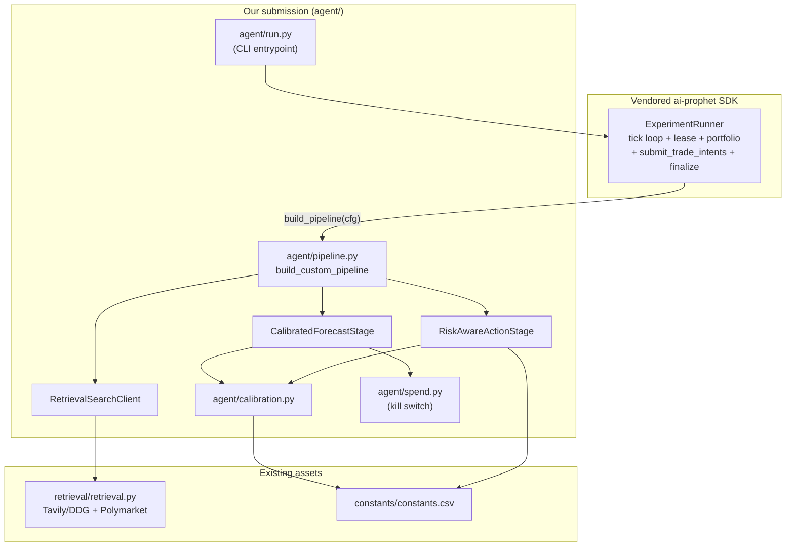

# Nailong UIC — Prophet Hacks 2026 Trading Track

Calibrated, market-anchored, Kelly-sized prediction-market trading agent
built on the vendored `ai-prophet` SDK. Runs unattended for the 14-day
evaluation window (May 17 → May 31, 2026) and emits trade intents on every
15-minute tick.

---

## What it does

Every 15 minutes, for each candidate prediction market on Prophet Arena:

1. **Review** (SDK LLM) picks which markets to spend the tick budget on.
2. **Search** (our [`RetrievalSearchClient`](agent/stages/retrieval_search.py))
   runs the SDK-generated query through Tavily (DuckDuckGo fallback),
   filters blocked domains, and ranks by category-aware quality.
3. **Forecast** (our [`CalibratedForecastStage`](agent/stages/calibrated_forecast.py))
   gets a raw `p_yes` from the LLM, pulls the Kalshi mid from the candidate
   quote, optionally pulls a Polymarket second-market signal, and blends:
   `p_final = clip(α·p_model + (1-α)·p_anchor, ±0.30 from market)`
   with α driven by retrieval confidence.
4. **Action** (our [`RiskAwareActionStage`](agent/stages/risk_action.py))
   computes the better side, applies a half-Kelly sizing rule, and clips to
   every cap in [`constants/constants.csv`](constants/constants.csv) —
   `MAX_NOTIONAL_PER_MARKET=$1000`, `MAX_GROSS_EXPOSURE=$10000`,
   `MAX_OPEN_POSITIONS=30`, `MAX_TRADES_PER_TICK=20`. The deterministic
   sizer also obeys the position-flip-as-sell rule and relaxes the
   minimum-edge threshold when on pace to undershoot the 14-trade floor.

The SDK's [`ExperimentRunner`](packages/cli/ai_prophet/trade/runner.py)
handles the tick loop, lease management, portfolio fetch, intent
submission, finalization, and timeout enforcement. We never re-implement
any of that.

---

## Architecture



---

## Run it

Fresh-clone-to-running target: **under 10 minutes.**

```bash
# 1. Install deps (vendored SDK + retrieval stack)
python -m pip install -r requirements.txt

# 2. Fill in credentials
cp .env.template .env
# Edit .env and set at minimum:
#   PA_SERVER_API_KEY=prophet_xxx
#   OPENROUTER_API_KEY=sk-or-xxx
#   TAVILY_API_KEY=tvly-xxx       (optional; DDG used as fallback)

# 3. Smoke test (verifies pipeline construction + creds, no tick lease)
bash scripts/run.sh --dry

# 4. Optional: warm the retrieval cache before going live
python scripts/prewarm.py --limit 100

# 5. Start trading. Run inside tmux/screen so it survives disconnects.
bash scripts/run.sh
```

On Windows: `scripts\run.bat` is the equivalent of `scripts/run.sh`.

---

## Configuration

Two sources, in order of precedence:

| Source | Owns |
|---|---|
| [`.env`](.env) | Credentials, kill-switch, calibration knobs, log level |
| [`constants/constants.csv`](constants/constants.csv) | Trading-Track ruleset numbers (caps, fees, tick cadence). Mirror of the official rules PDFs. |

Override any `RuntimeConfig` field by setting the matching env var (see
[`agent/settings.py`](agent/settings.py) for the full list). Common knobs:

| Env var | Default | Purpose |
|---|---|---|
| `ALPHA_HIGH` | `0.7` | Trust-the-model weight when retrieval confidence is high |
| `ALPHA_LOW` | `0.25` | Trust-the-model weight when retrieval confidence is low |
| `MAX_EDGE_DEVIATION` | `0.30` | Hard cap on `\|p_final - p_market\|` |
| `MIN_EDGE` | `0.05` | Standard trade gate |
| `MIN_EDGE_RELAXED` | `0.03` | Used when lifetime fills < 14 |
| `KELLY_FRACTION` | `0.5` | Half-Kelly by default |
| `KILL_SWITCH_USD` | `180` | Cumulative spend at which forecasts fall back to market mid |

---

## CLI reference

```
python -m agent.run [OPTIONS]

  -m, --models TEXT          Repeatable. Default: openrouter:anthropic/claude-sonnet-4
  -s, --slug TEXT            Experiment slug. Default: nailong_v01
  -r, --replicates INT       Replicates per model. Default: 1
  -t, --max-ticks INT        Default: 1344 (= 14 days x 96 ticks/day)
  --starting-cash FLOAT      Default: INITIAL_CASH from constants.csv ($10k)
  --trace-dir PATH           Default: ./data/traces
  --publish-reasoning/...    Persist per-stage reasoning. Default: on
  --api-url TEXT             Default: PA_SERVER_URL from .env
  --dry                      Build pipeline and verify creds; skip tick loop
  -v, --verbose              Verbose logging
```

---

## Reliability guarantees

| Failure mode | What happens |
|---|---|
| LLM provider returns malformed JSON | SDK retries; if still bad, the stage errors and ExperimentRunner finalizes the participant FAILED for that tick only |
| Tavily rate-limit | `retrieval.raw_search` falls back to DuckDuckGo automatically |
| Polymarket API down or thin volume | Falls back to Kalshi-only anchor, no degradation in PnL |
| Cumulative spend > `KILL_SWITCH_USD` | `CalibratedForecastStage` returns `p_yes = market_mid` instead of calling the LLM |
| Tick budget exceeded | Per-participant lease bumping in `ExperimentRunner` handles it |
| Process crash | Restart with the same `--slug`; the SDK resumes from the next un-finalized tick |
| Held YES, model now prefers NO | `RiskAwareActionStage` emits a SELL on the held side (per CustomAgentTradingRules.pdf), not a BUY on the opposite side |

---

## Repo layout

```
agent/                # Our submission (the only code we wrote)
  run.py              # CLI entrypoint
  pipeline.py         # build_custom_pipeline; wires custom stages into AgentPipeline
  settings.py         # RuntimeConfig loaded from constants.csv + .env
  calibration.py      # Pure math: alpha blend, edge cap, Polymarket consensus
  spend.py            # SQLite cost ledger + kill switch
  stages/
    retrieval_search.py   # SearchClient adapter -> retrieval.raw_search
    calibrated_forecast.py
    risk_action.py
  tests/              # 32 unit tests (pytest)
retrieval/            # Web search + Polymarket + category routing (kept as-is)
constants/            # Ground-truth ruleset
packages/             # Vendored ai-prophet SDK (DO NOT EDIT)
scripts/              # run.sh, run.bat, prewarm.py
data/                 # Runtime artifacts (traces, retrieval cache, retrieval log)
PROPHET_HACKS_TRADING_PLAN.md   # Authoritative build plan
PROPHET_HACKS_GAME_PLAN.md      # Historical context (superseded)
P2_RETRIEVAL_README.md          # Historical context (partially superseded)
```

---

## Testing

```bash
python -m pytest agent/tests/ -v
```

32 tests cover the calibration math (alpha blend, deviation cap, Polymarket
consensus) and the risk-action stage (every constants.csv cap, position
flip rule, minimum-edge gate, 14-trade-floor relaxation).

---

## License

MIT. See [LICENSE](LICENSE). The vendored SDK under `packages/` carries
the upstream `ai-prophet` MIT license.
